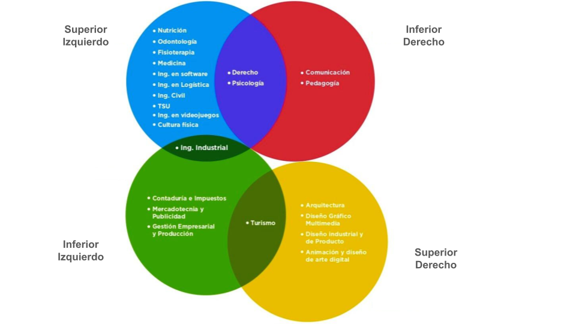

```{r include=FALSE}
#librerias
library(fmsb)
library(knitr)

#CUANDO TERMINE LA PRUEBA DEL MARKDOWN ESTO LO SUSTITUYO EN EL YAML
#---
#title: "Prueb de dominancia cerebral"
#output: pdf_document
#params:
#  reporte: NULL
#fontsize: 12pt
#mainfont: ArialMT
#latex_engine: xelatex
#header-includes:
#  - \usepackage{graphicx}
#  - \usepackage{fancyhdr}
#  - \pagestyle{fancy}
#  - \fancyhf{}
#  - \renewcommand{\headrulewidth}{0pt}
#  - \renewcommand{\footrulewidth}{0pt}
#  - \fancyfoot[C]{\includegraphics[width=\textwidth]{www/pie_paginas.png}}
#---

fecha_prueba <- Sys.Date()
hora_prueba <- format(Sys.time(), "%H:%M:%S")

```

{width=100%}

## Finalidad de la prueba
De una manera gráfica esta herramienta busca identificar el tipo de dominancia cerebral a la que perteneces o tienes principalmente y a las carreras en las que mejor te desempeñarías para el éxito en tu vida profesional.

<center>

</center>

## Datos del alumno

**Fecha y hora en la que se hizo la prueba** `r fecha_prueba` `r hora_prueba`

\textcolor{green!70!black}{\rule{\linewidth}{2.5pt}}
\begin{minipage}[t]{0.48\textwidth}
\textbf{Nombre completo:} `r params$Nombre_aspirante`
\end{minipage}
\hfill
\begin{minipage}[t]{0.48\textwidth}
\raggedleft
\textbf{Edad:} `r params$Edad`
\end{minipage}
\textcolor{green!70!black}{\rule{\linewidth}{2.5pt}}
\begin{minipage}[t]{0.48\textwidth}
\textbf{Carrera a la que aspiras:} `r params$Carrera_deseada`
\end{minipage}
\hfill
\begin{minipage}[t]{0.48\textwidth}
\raggedleft
\textbf{Fecha de nacimiento:} `r params$F_nacimiento`
\end{minipage}
\textcolor{green!70!black}{\rule{\linewidth}{2.5pt}}
\begin{minipage}[t]{0.48\textwidth}
\textbf{Escuela de procedencia:} `r params$Escuela`
\end{minipage}
\hfill
\begin{minipage}[t]{0.48\textwidth}
\raggedleft
\textbf{Grado:} `r params$Grado`
\end{minipage}
\textcolor{green!70!black}{\rule{\linewidth}{2.5pt}}
\begin{minipage}[t]{0.48\textwidth}
\textbf{Correo electrónico:} `r params$Correo`
\end{minipage}
\hfill
\begin{minipage}[t]{0.48\textwidth}
\raggedleft
\textbf{Teléfono:} `r params$Telefono`
\end{minipage}
\textcolor{green!70!black}{\rule{\linewidth}{2.5pt}}
\textbf{Nombre completo del (tutor):} `r params$Nombre_tutor`
\textcolor{green!70!black}{\rule{\linewidth}{2.5pt}}
\begin{minipage}[t]{0.48\textwidth}
\textbf{Correo electrónico (tutor):} `r params$Correo_tutor`
\end{minipage}
\hfill
\begin{minipage}[t]{0.48\textwidth}
\raggedleft
\textbf{Teléfono (tutor):} `r params$Telefono_tutor`
\end{minipage}
<center>

</center>

# Habilidades seleccionadas

**Tus habilidades**

\begin{minipage}[t]{0.48\textwidth}
\textbf{•} `r params$etapa1_seleccion1`
\end{minipage}
\hfill
\begin{minipage}[t]{0.48\textwidth}
\raggedleft
\textbf{•} `r params$etapa1_seleccion2`
\end{minipage}

\begin{minipage}[t]{0.48\textwidth}
\textbf{•} `r params$etapa1_seleccion3`
\end{minipage}
\hfill
\begin{minipage}[t]{0.48\textwidth}
\raggedleft
\textbf{•} `r params$etapa1_seleccion4`
\end{minipage}

\begin{minipage}[t]{0.48\textwidth}
\textbf{•} `r params$etapa1_seleccion5`
\end{minipage}
\hfill
\begin{minipage}[t]{0.48\textwidth}
\raggedleft
\textbf{•} `r params$etapa1_seleccion6`
\end{minipage}

\begin{minipage}[t]{0.48\textwidth}
\textbf{•} `r params$etapa1_seleccion7`
\end{minipage}
\hfill
\begin{minipage}[t]{0.48\textwidth}
\raggedleft
\textbf{•} `r params$etapa1_seleccion8`
\end{minipage}

**Tu habilidad principal**

- `r params$etapa2_seleccion`

**Tu peor habilidad**

- `r params$etapa3_seleccion`

# Hemisferios

``` {r include=FALSE}

cuadrantes<-data.frame(
  `Superior izquierdo` = params$SupIzq,
  `Superior derecho` = params$SupDer,
  `Inferior izquierdo` = params$InfIzq,
  `Inferior derecho` = params$InfDer,
   check.names = FALSE
)
cuadrantes[is.na(cuadrantes)] <- 0

hemisferio_dominante<-names(which.max(cuadrantes))

data2 <- rbind(rep(8,4), rep(0,4), cuadrantes)
colnames(data2) <- c("Superior \nizquierdo","Superior \nderecho",
                         "Inferior \nizquierdo","Inferior \nderecho")
```

**Puntaje para las distintas zonas**

```{r echo=FALSE}
kable(cuadrantes[,1:4])
```

**Zona con mayor dominancia:** `r hemisferio_dominante`

```{r echo=FALSE, fig.width=4.5, fig.height=4}
par(mar = c(1, 1, 1, 1),xpd = NA )

radarchartcirc(data2,
               pcol = "#6B8E23",
               pfcol = adjustcolor("#6B8E23", 0.1),
               plwd = 3,
               cglcol = "grey30",
               caxislabels = c("0","2","4","6","8"),
               calcex=0.5,
               cglwd = 2,
               cglty = 1.5,
               axislabcol = "grey20",
               maxmin = TRUE,
               vlcex = 1.2)

```
<center>

</center>


# Programa educativo que se adapta a tu estilo de pensamiento

{height=1920,width=1080}

\textcolor{green!70!black}{\rule{\linewidth}{2.5pt}}

\begingroup
\fontfamily{phv}\selectfont
\small
La Universidad Cuauhtémoc, Plantel Querétaro, A.C. con domicilio en Blvd. Bernardo Quintana Arrioja No. 229 A, Fraccionamiento Los Arcos, Santiago de Querétaro, Qro. México, utilizara sus datos personales y sensibles para la identificación, operacion, administración y análogos, que sean necesarios para la prestación de los servicios académicos y administrativos de la Universidad Cuauhtémoc Plantel Querétaro, A.C. Para mayor información usted puede acceder al aviso de privacidad en \href{https://www.ucq.edu.mx/uc}{https://www.ucq.edu.mx/uc}
\endgroup


     